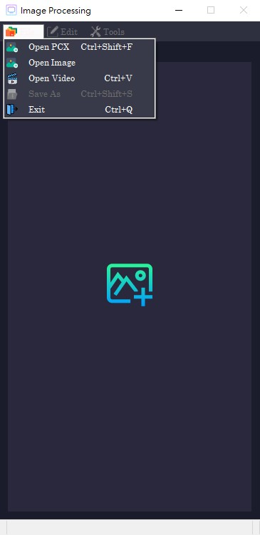
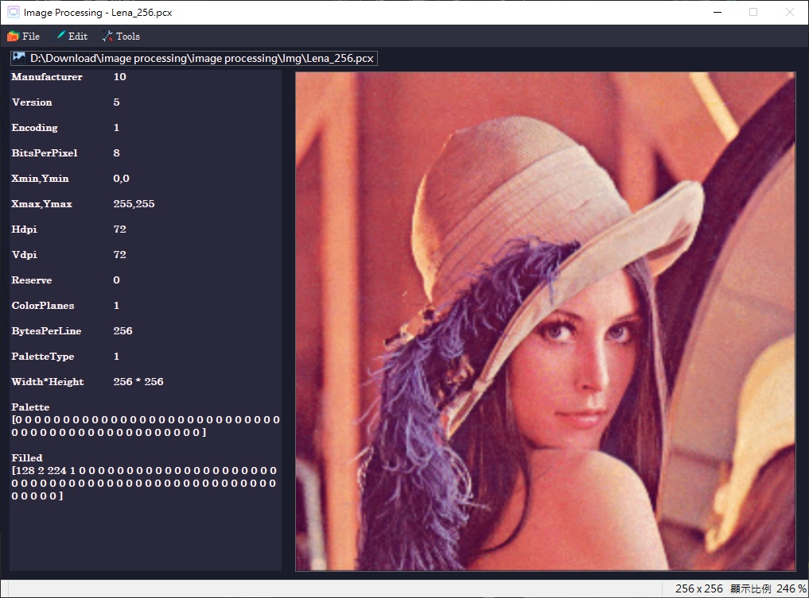
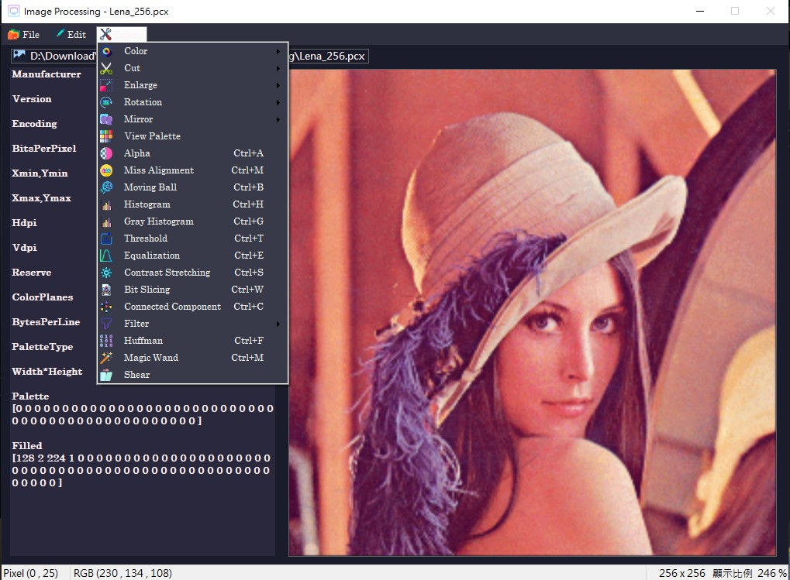
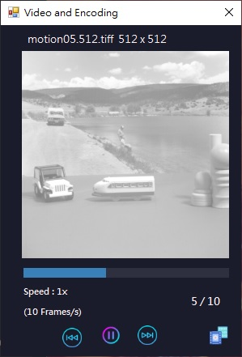

# Image Processing Application (C#)

使用 C# WinForm 實作影像處理應用程式，可讀取影像或影片(.*tiff)並進行處理、編碼等。

## 功能簡介

- **影像讀寫**：讀取 PCX/PNG/JPG 圖檔並顯示，其中若讀取PCX檔案將會於主畫面左側顯示其標頭檔，並可將圖檔另存為BMP影像。
- **基本功能**：影像通道檢視、裁切、放大縮小、旋轉、鏡像、形變等功能。
- **進階功能**：魔術棒、影像二值化、對比拉伸、位元切片、連通元件、影像濾波器、影像編碼與壓縮。
- **影像壓縮**：使用霍夫曼編碼。
- **影片功能**：讀取多張影像，並可進行影片編碼(MPEG)，當中包含多種不同編碼演算法。

## 使用畫面截圖

以下是實際使用畫面截圖：

